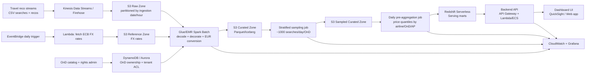

#Context

Amadeus is a company which provides insights about flights prices across different Origins-Destinations (OnDs). For example, their service is taking as input a search query for best flights between XXX Origin and XXX Destination and then it returns a serie of recommendations to the website that made the query.

Problematic : 

As a an airline, I would like to compare my prices with other airlines.

Objective :

Graph: Price evolution over advance purchase per airline​

Mandatory inputs for dashboard: ​

-OnD (Origin-Destination city pair)​
-One Way / Round Trip​

Many optional filters:​

-Search country​
-Search date range​
-Departure date range​
-Stay durations​
-Nb of connections

#How the data is decoded / decorated

-> read the "README.md" file

#Constraints

Commercials​

An airline only looks at OnDs of interest​

-Catalog price: $10 per OnD per year​
-Target is 10 airline customers​
-10,000 OnDs per airline, with some overlap​
-50,000 OnDs available in Price Benchmark​
-$1 mio revenue per year expected for Amadeus

Latency​

No need for real time​

-24h delay is acceptable​
-Pre-agregation​
-Latency makes it possible…​
-Dashboard filtering options makes it challenging​
-Not recommended

Volumes​

Input:​

-10k searches/s ​
-60 recos / tx (captured)​
-input: 50 Bio recos/day​
-20Bytes per CSV record (compressed)​

Storage​

-2 years history​
-Data are redundant  stratified sampling​
-Around 1000 searches per day per OnD are enough!​
-To store: 1000 x 50000 x 60 = 3 Bio recos/days

-> 50000 gives 90% of the traffic percentage (researchs)

#Architecture structure

Enrich architecture schema​

-Processing pipeline​

-How are rates retrieved from ECB and made available to processing​

-Management of OnDs and access rights​
​
Stratified sampling​

How to implement stratified sampling? (I.e. around 1000 searches per OnD per day)​

Monitoring​

What KPIs should we monitor?

#What to do for now

A relatively detailed architecture diagram: the data processing pipeline, exchange rate management, the technologies you have in mind (AWS for the cloud solution)...
a solution for stratified sampling (approximately 1000 searches per OnD per day)
Some KPIs that are important to be monitored.

---

#Proposed solution (AWS)

##1) End-to-end architecture diagram

##2) Processing pipeline (daily, non real-time)

1. Ingest raw CSV into S3 `raw` (immutable).
2. Retrieve daily ECB rates and store as reference table.
3. Decode and decorate records (same semantics as `recoReader.py`):
	 - `OnD`, `trip_type`, `advance_purchase`, `stay_duration`
	 - `price_EUR`, `taxes_EUR`, `fees_EUR`
	 - `main_marketing_airline`, `nb_of_flights`, geo fields
4. Apply data quality checks and reject malformed records to quarantine.
5. Write curated partitioned datasets.
6. Run stratified sampling and produce sampled table.
7. Build pre-aggregated marts for dashboard latency and cost control.

##3) Exchange-rate management

- Source: ECB daily rates (`eurofxref`).
- Retrieval: scheduled daily Lambda (idempotent).
- Storage: versioned S3 path (`fx_date=YYYY-MM-DD`) + Glue catalog.
- Join rule: use FX rate at `search_date` (or last available prior business day).
- Controls:
	- freshness SLA < 24h
	- missing currency alerts
	- backfill capability for historical recompute

##4) OnD and access-rights management

- Tenant model: `airline_id` + allowed OnD list.
- Rights table example fields:
	- `airline_id`
	- `OnD`
	- `valid_from`, `valid_to`
	- `status` (active/suspended)
- Enforcement:
	- backend always injects tenant filter
	- optional row-level policy in Redshift/Lake Formation
- Admin UI capabilities:
	- add/remove OnDs
	- upload bulk OnD entitlements
	- audit access changes

##5) Stratified sampling design (~1000 searches per day per OnD)

Stratum definition:

- minimum: (`event_date`, `OnD`)
- recommended: (`event_date`, `OnD`, `trip_type`)

For each stratum $s$ with volume $N_s$:

$$
p_s = \min\left(1, \frac{1000}{N_s}\right)
$$

Deterministic selection:

1. Compute `u = hash(search_id) / max_hash` in $[0,1)$.
2. Keep search if $u < p_s$.

Weight for unbiased aggregate estimation:

$$
w_s = \frac{1}{p_s}
$$

This gives stable reruns, distributed execution, and exact full keep for low-volume strata.

##6) KPI monitoring

###A. Pipeline reliability
- ingestion lag (`source -> raw`, `raw -> curated`)
- job success rate
- batch runtime and backlog

###B. Data quality
- parse error rate
- invalid/missing currency rate
- missing FX conversion rate
- duplicate `search_id` ratio

###C. Sampling quality
- achieved sample size vs target (1000)
- sampling ratio distribution by OnD
- sampled vs full drift on median price and AP distribution

###D. Product and performance
- API p95/p99 latency
- dashboard freshness (hours since last successful batch)
- query failure rate
- tenant coverage (% entitled OnDs available)

###E. Cost
- storage growth/day
- compute cost per processed billion recos
- serving cost per tenant