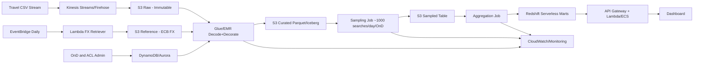

# Detailed Workflow – Air Price Benchmark Pipeline

## Purpose

This document explains, step by step, how to implement the full workflow for the Air Price Benchmark product on AWS, from raw ingestion to dashboard-ready aggregates.

The workflow is designed for:

- very high input volume,
- daily refresh (no real-time requirement),
- strong data quality control,
- tenant-based access rights,
- cost-efficient storage and querying.

---

## High-level flow

---

## Step 1 — Ingest raw CSV into S3 raw (immutable)

### Objective

Capture source data exactly as produced and preserve it permanently as a replayable source of truth.

### Implementation

1. Producers publish events (CSV lines or CSV chunks) to Kinesis.
2. Kinesis Firehose delivers data to S3 raw bucket.
3. Data is written as compressed files (e.g., GZIP) with partitioned paths.

### Recommended AWS services

- Amazon Kinesis Data Streams
- Amazon Kinesis Data Firehose
- Amazon S3 (raw bucket)
- AWS KMS (encryption)

### S3 path example

`s3://air-price-benchmark-raw/ingestion_date=2026-03-12/hour=10/part-0001.csv.gz`

### Immutability controls

- S3 Versioning enabled
- Optional S3 Object Lock (WORM)
- Deny overwrite/delete by default IAM policy

### Why this matters

- Reprocessing is possible when business logic changes.
- Auditability is guaranteed.
- No risk of accidental data rewrite.

---

## Step 2 — Retrieve daily ECB rates and store as reference table

### Objective

Provide reliable exchange rates for converting all prices to EUR during enrichment.

### Implementation

1. EventBridge triggers a daily Lambda job.
2. Lambda downloads ECB rates (`eurofxref`).
3. The job normalizes columns (currency, rate, fx_date, source, ingestion_ts).
4. It stores the result in S3 reference zone and updates Glue Catalog table.

### Recommended AWS services

- Amazon EventBridge (scheduler)
- AWS Lambda
- Amazon S3 (reference bucket)
- AWS Glue Data Catalog

### Join policy

Use the rate at `search_date`; if absent (weekend/holiday), use last available prior business day.

### Data quality checks

- File freshness < 24h
- Mandatory currencies present
- Positive non-zero rates

---

## Step 3 — Decode and decorate records (as in recoReader.py)

### Objective

Transform raw CSV into analytical records with business fields required by dashboard filters and charts.

### Input semantics reference

The transformation follows logic implemented in `recoReader.py` and described in `README.md`.

### Implementation logic

1. Parse each raw row.
2. Group all rows by `search_id`.
3. Build hierarchical objects: Search → Recommendations → Flights.
4. Compute derived fields.

### Main derived fields

#### Search-level

- `OnD = origin_city-destination_city`
- `trip_type` (OW/RT)
- `advance_purchase = dep_date - search_date`
- `stay_duration = return_date - dep_date` (or -1 for OW)
- geo fields (`origin_country`, `destination_country`, `geo`, distance)

#### Recommendation-level

- `price_EUR`, `taxes_EUR`, `fees_EUR` (using ECB rates)
- `main_marketing_airline` (largest flown distance coverage)
- `main_operating_airline`
- `main_cabin`
- `nb_of_flights`, `flown_distance`

### Recommended AWS services

- AWS Glue (Spark ETL)
- Amazon EMR (if larger/custom Spark control required)

### Why distributed Spark

Volume is massive; grouping by `search_id` and computing flight-level enrichments requires scalable distributed processing.

---

## Step 4 — Apply data quality checks and quarantine malformed records

### Objective

Ensure only trusted records reach curated datasets while preserving bad records for diagnostics.

### Validation examples

- Schema/type validation (date, numeric, string)
- Required fields present (`search_id`, `currency`, `price`, dates)
- Business constraints (`price >= 0`, `nb_of_flights > 0`)
- Domain checks (IATA-like code formats, valid currency codes)
- Referential checks (FX exists for needed date/currency)

### Output split

- Valid records → curated flow
- Invalid records → quarantine zone with `error_code`, `error_message`, `raw_payload`

### Recommended AWS services

- AWS Glue Data Quality (or Great Expectations / Deequ within Glue)
- S3 quarantine bucket/prefix
- CloudWatch alarms for threshold breaches

---

## Step 5 — Write curated partitioned datasets

### Objective

Store validated, enriched records in a query-optimized format for analytics and downstream jobs.

### Storage format

- Parquet + compression (Snappy/ZSTD)
- Prefer Iceberg table format for schema evolution and partition management

### Suggested partitions

- `event_date`
- `OnD`
- `trip_type`

Keep high-cardinality fields (e.g., airline code) as columns, not partitions.

### Recommended AWS services

- Amazon S3 curated zone
- AWS Glue Catalog + Iceberg support
- Athena/Redshift Spectrum for ad hoc access

### Why partitioning

- Lower scan volume
- Faster filtering by dashboard dimensions
- Better cost control

---

## Step 6 — Run stratified sampling and produce sampled table

### Objective

Reduce data volume while preserving representativeness, targeting around 1000 searches/day per OnD stratum.

### Strata definition

Recommended stratum key:

- (`event_date`, `OnD`, `trip_type`)

### Sampling formula

For each stratum $s$ with size $N_s$:

$$
p_s = \min\left(1, \frac{1000}{N_s}\right)
$$

Keep each search with deterministic random rule:

- compute $u = \text{hash}(search\_id)/\text{max\_hash}$
- keep if $u < p_s$

Weight for unbiased estimates:

$$
w_s = \frac{1}{p_s}
$$

### Why deterministic hashing

- Reproducible reruns
- No dependence on file order
- Works naturally in distributed Spark

### Output

Sampled table with columns including:

- `sampling_rate`
- `sampling_weight`
- `sampled_flag = true`

---

## Step 7 — Build pre-aggregated marts for dashboard latency and cost

### Objective

Serve dashboards with low-latency, low-cost queries without scanning full detailed datasets.

### Typical aggregates

- price metrics: avg, min, max, p50, p75, p90
- volumes: search count, recommendation count
- segmentation:
	- `OnD`
	- `trip_type`
	- `main_marketing_airline`
	- `advance_purchase_bucket`
	- `search_country`
	- `nb_of_connections_bucket`

### Time granularity

- daily aggregates (mandatory)
- weekly/monthly rollups (optional, materialized)

### Recommended AWS services

- Glue/EMR for daily aggregation jobs
- Redshift Serverless for serving marts
- API Gateway + Lambda/ECS backend
- QuickSight (or custom UI)

### Why marts

- Stable p95 query latency
- Predictable cost at high dashboard concurrency
- Simpler access control enforcement

---

## Cross-cutting concerns

### Orchestration

- AWS Step Functions or Glue Workflows
- Retry policies + dead-letter handling

### Security

- IAM least privilege
- S3 and Redshift encryption via KMS
- Row-level security by tenant + entitled OnDs

### Monitoring KPIs

- ingestion lag
- job success/failure
- data quality reject rate
- sample-size attainment vs target
- dashboard/API p95 latency
- cost per billion records processed

---

## Suggested physical zones

- `s3://.../raw/`
- `s3://.../reference/fx/`
- `s3://.../quarantine/`
- `s3://.../curated/`
- `s3://.../sampled/`
- `redshift://serving_marts/*`

This structure cleanly separates acquisition, trust level, and serving purpose.

